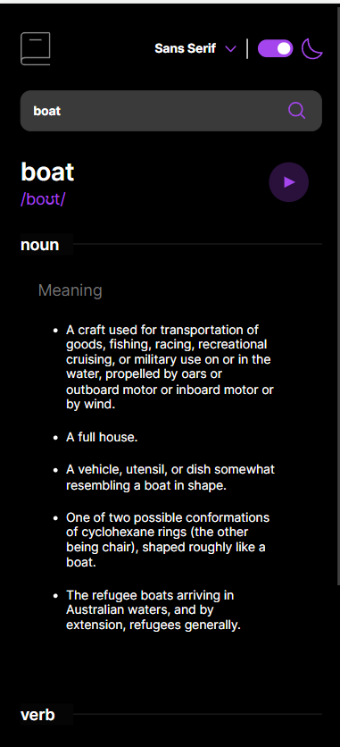
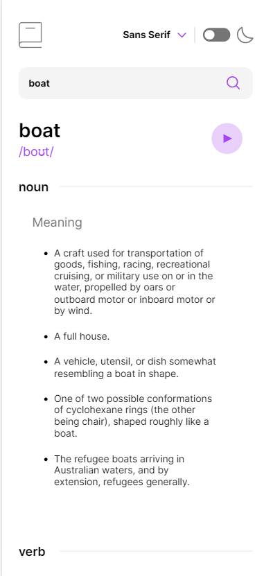

## Table of contents

- [Overview](#overview)
  - [Features](#features)
  - [Screenshot](#screenshot)
  - [Links](#links)
  - [Built with](#built-with)
- [Author](#author)
- [Acknowledgments](#acknowledgments)

## Overview

### Features

The Dictionary app is a powerful tool that allows users to search for word definitions and translations quickly and easily. The app is built with a variety of technologies, including Vite, React, TypeScript, Sass. The app has theme changing and audio functionalities, and it's fully responsive and modern looking.

### Screenshot

### Links

- Live Site URL: [Add live site URL here](https://your-live-site-url.com)

### Built with

The app was built using a number of different technologies and tools, including:

- [Vite](https://vitejs.dev/): a fast build tool that allows for rapid development and quick feedback loops
- [TypeScript](https://www.typescriptlang.org/): a statically-typed superset of JavaScript that provides better code reliability and improved tooling
- [React](https://react.dev/): a popular JavaScript library for building user interfaces
- [Sass](https://sass-lang.com/): a preprocessor scripting language that extends CSS and provides more features and flexibility
- [Vitest](https://vitest.dev/): a testing library specifically designed for use with Vite and Vue applications
- [React Testing Library](https://testing-library.com/): a testing utility for React that allows for easy and efficient testing of UI components
- [Dictionary API](https://dictionaryapi.dev/): a Javascript dictionary library

## Author

Bozai Cosmin

## Acknowledgments

This is a solution to the [Dictionary web app challenge on Frontend Mentor](https://www.frontendmentor.io/challenges/dictionary-web-app-h5wwnyuKFL). Frontend Mentor challenges help you improve your coding skills by building realistic projects.
